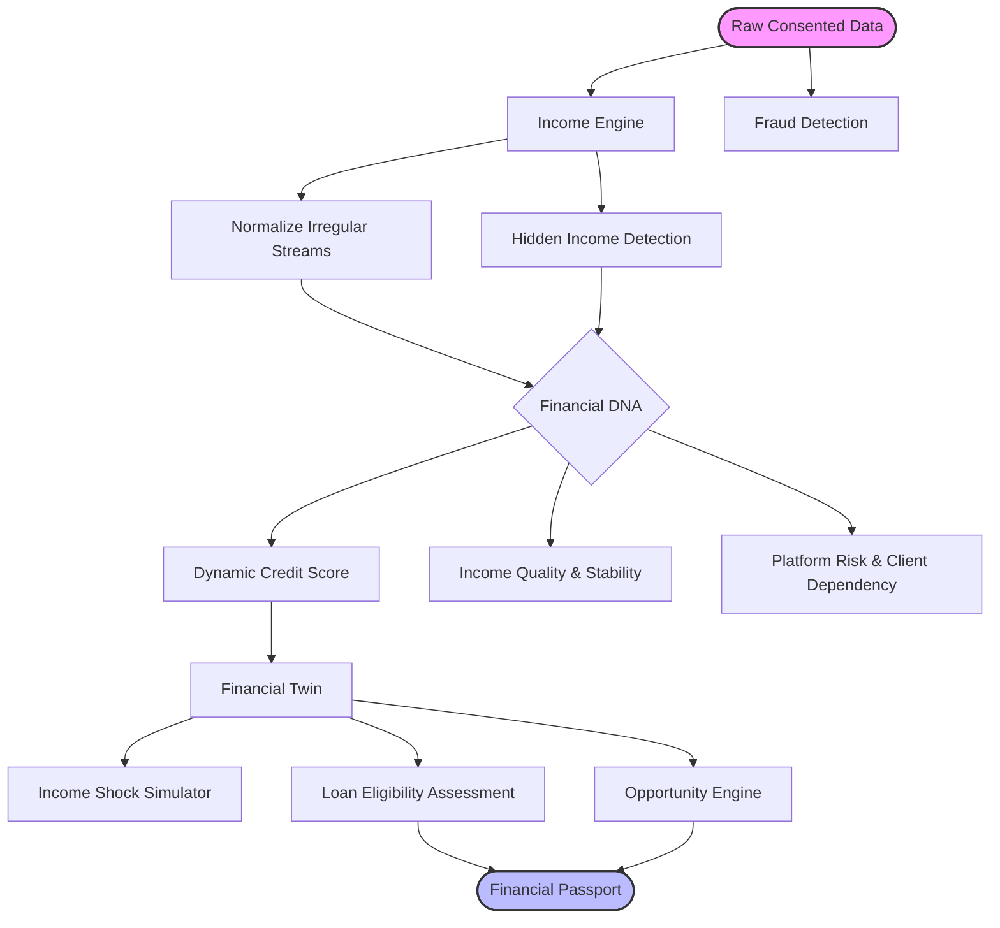
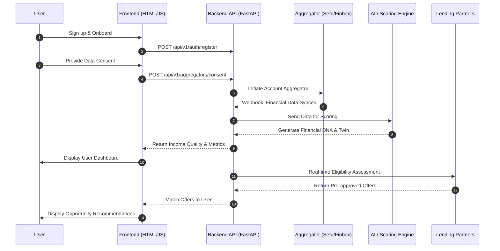

# Financial Identity AI — CrediTwin

**Your financial identity, beyond a credit score.**

An explainable, AI-driven platform for income intelligence, dynamic creditworthiness and financial identity — built for gig workers, freelancers and thin-file borrowers whom traditional bureaus overlook, and for the lenders and fintechs who want to serve them responsibly.

Instead of a single, backward-looking number, CrediTwin builds a living **Financial DNA** and **Financial Twin** for every user from consented, multi-source data, and keeps it explainable and up to date as new signals arrive.

---

## Why

Traditional credit and identity systems rely on static, backward-looking data — a formal payslip, a fixed bureau file — refreshed quarterly at best. That excludes gig workers, freelancers and the newly banked, and reacts too slowly to real income shocks.

CrediTwin aggregates consented financial data (bank feeds, UPI, Account Aggregator, GST), turns it into a continuously updated, explainable view of income quality, stability and creditworthiness, and exposes it through a dashboard and an API that lenders can plug into directly.

## Core capabilities

- **Financial DNA** — a persistent behavioral fingerprint of a user's financial habits
- **Financial Twin** — a living simulation model for testing "what-if" financial scenarios
- **Income Engine** — normalizes irregular income streams into a structured signal set, scoring income quality and stability
- **Dynamic Credit** — a creditworthiness score recalculated continuously, not once a quarter
- **Income Shock Simulator** — stress-tests a user's finances against job loss, rate hikes, or platform de-boarding
- **Platform Risk & Client Dependency** — flags over-reliance on a single gig platform or payer
- **Hidden Income Detection** — surfaces informal or undeclared income for a fairer picture of repayment capacity
- **Fraud Detection** — flags anomalous transaction patterns and identity mismatches in real time
- **Opportunity Engine** — recommends concrete next steps based on a user's Financial Twin
- **Explainable AI throughout** — every score ships with a human-readable rationale, never a black box
- **Financial Passport** — a portable, shareable financial identity credential
- **Loan Eligibility** — real-time eligibility assessment for lending partners
- **Admin Dashboard** — operational visibility, overrides and an audit trail

## Architecture

```
External Sources → Ingestion & Consent Layer → AI Processing Engines → Data & Security Layer → API & Dashboard Layer
(Bank feeds, UPI,    (Scoped, revocable         (Income Engine,          (PostgreSQL, Neo4j,      (REST API,
 Account Aggregator,  consent tokens)             Financial DNA,           Redis, encryption        admin & user
 GST)                                             Fraud Detection)         at rest)                 dashboards)
```

Every score is recalculated as new signals arrive, and every data pull, model call and dashboard read is authenticated, authorized and logged end-to-end (zero-trust, consent-first by design).

## Tech stack

| Layer | Technology |
|---|---|
| Frontend | Static HTML/CSS/JS (no build step) — landing, onboarding, dashboard, and per-feature pages |
| Backend API | FastAPI (async), Python 3.11+ |
| Database | PostgreSQL via SQLAlchemy 2.0 async + asyncpg (SQLite for local dev) |
| Graph store | Neo4j (relationship/network signals) |
| Migrations | Alembic |
| Auth | JWT in HttpOnly secure cookies, argon2id password hashing |
| Scoring / ML | scikit-learn, pandas, numpy — pluggable rules-based or AI-assisted scoring engine |
| AI | Anthropic API (Claude) for explainable, natural-language score rationale |
| Deployment | Vercel serverless functions, Vercel Cron for nightly recompute |
| Logging | structlog |

## Repository structure

```
├── index.html, landing.html, onboarding.html   # marketing + onboarding flow
├── dashboard.html, financial-dna.html,          # per-feature product pages
│   financial-twin.html, income-quality.html,
│   emergency-score.html, client-dependency.html,
│   opportunity-engine.html, loan-eligibility.html
├── admin.html, settings.html, login.html
├── assets/                                      # app.js, api.js, auth.js, render.js, store.js, styles.css
└── backend/
    ├── app/
    │   ├── api/v1/        # FastAPI routers
    │   ├── models/        # SQLAlchemy 2.0 declarative models
    │   ├── schemas/       # Pydantic v2 DTOs
    │   ├── services/
    │   │   ├── scoring/   # scoring engine interface + rule-based implementation
    │   │   ├── aggregators/  # data provider adapters (mock / Setu)
    │   │   ├── identity.py, lenders.py, twin.py, aggregation.py
    │   ├── tasks/          # background/cron jobs
    │   ├── config.py, db.py, security.py, deps.py, main.py, seed.py
    ├── alembic/            # DB migrations
    ├── tests/              # pytest suite (scoring parity + API tests)
    ├── vercel.json
    └── pyproject.toml
```

## Getting started

### Backend

```bash
cd backend
cp .env.example .env          # set JWT_SECRET, COOKIE_SECURE=false for local dev
pip install -e .

alembic upgrade head          # apply schema
python -m app.seed            # seed catalog data + demo user
uvicorn app.main:app --reload --port 8000
```

- API docs (dev only): `http://localhost:8000/docs`
- API base path: `/api/v1`
- Health check: `GET /health`

**Demo account** (created by the seed script):
- Email: `arjun@joshi.studio`
- Password: `Arjun@2026`

### Frontend

The frontend is static HTML/CSS/JS — no build step. Serve the repo root with any static server, e.g.:

```bash
python -m http.server 5500
```

Then open `http://localhost:5500/landing.html`.

## API surface

| Method | Path | Purpose |
|---|---|---|
| POST | `/api/v1/auth/register` | Create account + set cookies |
| POST | `/api/v1/auth/login` | Issue access + refresh cookies |
| POST | `/api/v1/auth/refresh` | Rotate the refresh token |
| POST | `/api/v1/auth/logout` | Revoke the refresh token |
| GET | `/api/v1/auth/me` | Current user |
| GET | `/api/v1/identity/me` | Full identity object |
| POST | `/api/v1/onboarding/{step}` | Autosave onboarding step |
| GET | `/api/v1/score/dna` | Compute + persist a Financial DNA snapshot |
| GET | `/api/v1/score/income-quality` | Income quality, volatility (CV) and YoY trend |
| GET | `/api/v1/score/history` | Last N score snapshots |
| POST | `/api/v1/score/twin/simulate` | Run a what-if cashflow simulation |
| GET | `/api/v1/lenders/offers` | Live lender offers for the user |
| POST | `/api/v1/lenders/offer/{id}/persist` | Persist a pre-approval |
| GET | `/api/v1/opportunities` | Personalized opportunity recommendations |
| POST | `/api/v1/aggregators/consent` | Create an Account Aggregator consent |
| POST | `/api/v1/aggregators/consent/{id}/pull` | Pull financial data for a consent |
| GET | `/api/v1/aggregators/consents` | List consents |
| POST | `/v1/webhooks/consent/...` | Provider callback webhooks |
| GET | `/api/v1/admin/{users,audit,scores}` | Admin views (requires `is_admin`) |

## Testing

```bash
cd backend
pytest -q
```

`tests/test_scoring.py` asserts numeric parity between the rule-based Python scoring engine and the reference implementation used on the frontend — this stays green even without a database. The rest of the suite spins up Postgres for integration coverage.

## Deployment

The backend ships as a Vercel serverless function (`backend/api/index.py`, see `backend/vercel.json`), with a Vercel Cron job hitting `/api/v1/cron/recompute-all` nightly to refresh every user's score. In production, point `DATABASE_URL` at a managed Postgres instance, enable `NEO4J_ENABLED` against a Neo4j Aura instance, set `COOKIE_SECURE=true` and a real `JWT_SECRET`, and swap `AGGREGATOR_PROVIDER` to a live provider (`setu` / `finbox`) with credentials.

## Data Flow



### Interaction Sequence



## Team

Built by **Team VMax** — Gaurav Jain, Aditya Gavane, Nishad Kulkarni, Amulya Dongre.
